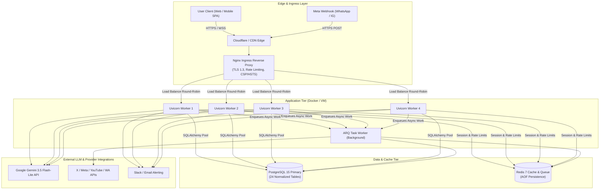

# PRODUCTION DEPLOYMENT & INFRASTRUCTURE GUIDE

**Platform:** Kalyan | Brutally Honest Indian Internet Friend AI Platform  
**Target Environment:** Production / Multi-Worker High Availability  
**Classification:** DevOps & Systems Engineering Reference  
**Last Updated:** 2026-10-05  

---

## 1. Production Topology & Architecture



---

## 2. Infrastructure & System Requirements

### Recommended Hardware Specs (Production Staging / Live Tier 1)
- **CPU**: 4 vCPUs (x86-64 or ARM64)
- **Memory**: 8 GB RAM (minimum 4 GB allocated to PostgreSQL + Redis buffers)
- **Storage**: 50 GB NVMe SSD with automated hourly snapshotting
- **Network**: 1 Gbps egress with DDoS mitigation (Cloudflare / AWS Shield)
- **OS**: Ubuntu 22.04 LTS or Debian 12 / Enterprise Linux

---

## 3. Environment & Secrets Management

All production configuration must be passed via environment variables or secret vaults. **Never hardcode secrets or commit `.env` to Git.**

### Required Production Environment Variables:

```ini
# Application Base
APP_ENV=production
PROJECT_NAME="Kalyan - Brutally Honest Indian Internet Friend"
VERSION=1.0.0
SECRET_KEY=<GENERATE_STRONG_RANDOM_64_CHAR_HEX>
ACCESS_TOKEN_EXPIRE_MINUTES=1440

# LLM Providers (Google AI Studio / Gemini)
DEFAULT_PROVIDER=gemini
GEMINI_API_KEY=<PRODUCTION_GEMINI_API_KEY>
FALLBACK_PROVIDER=gemini

# Relational Database (PostgreSQL 15)
DATABASE_URL=postgresql+psycopg2://kalyan_user:<STRONG_DB_PASSWORD>@postgres:5432/kalyan_db

# Redis & Task Queue (Redis 7)
REDIS_URL=redis://redis:6379/0

# Social & Broadcast (Live Production Mode)
ENABLE_LIVE_SOCIAL_BROADCAST=false
X_ACCESS_TOKEN=<PROD_X_TOKEN>
INSTAGRAM_ACCESS_TOKEN=<PROD_IG_TOKEN>
INSTAGRAM_PAGE_ID=<PROD_IG_PAGE_ID>
WHATSAPP_TOKEN=<PROD_WA_TOKEN>
WHATSAPP_PHONE_NUMBER_ID=<PROD_WA_PHONE_ID>
WHATSAPP_VERIFY_TOKEN=<STRONG_VERIFY_TOKEN>
YOUTUBE_API_KEY=<PROD_YT_KEY>

# Security & CORS
BACKEND_CORS_ORIGINS=["https://kalyan.ai","https://app.kalyan.ai"]
ALLOWED_HOSTS=["kalyan.ai","app.kalyan.ai","127.0.0.1"]

# Observability & Alerting
SLACK_WEBHOOK_URL=https://hooks.slack.com/services/PROD/WEBHOOK/KEY
ALERT_EMAIL_RECIPIENT=ops-oncall@kalyan-personality.internal
SMTP_HOST=email-smtp.us-east-1.amazonaws.com
SMTP_PORT=587
```

---

## 4. Production Nginx Reverse Proxy Configuration

Place the following configuration at `/etc/nginx/sites-available/kalyan.ai`:

```nginx
upstream kalyan_backend {
    server 127.0.0.1:8000 max_fails=3 fail_timeout=10s;
    keepalive 32;
}

server {
    listen 80;
    server_name kalyan.ai app.kalyan.ai;
    return 301 https://$host$request_uri;
}

server {
    listen 443 ssl http2;
    server_name kalyan.ai app.kalyan.ai;

    # SSL Certificates (Let's Encrypt / Certbot)
    ssl_certificate /etc/letsencrypt/live/kalyan.ai/fullchain.pem;
    ssl_certificate_key /etc/letsencrypt/live/kalyan.ai/privkey.pem;
    ssl_protocols TLSv1.2 TLSv1.3;
    ssl_ciphers HIGH:!aNULL:!MD5;
    ssl_prefer_server_ciphers on;
    ssl_session_cache shared:SSL:10m;
    ssl_session_timeout 1d;

    # Enterprise Hardened Security Headers
    add_header X-Frame-Options "DENY" always;
    add_header X-Content-Type-Options "nosniff" always;
    add_header X-XSS-Protection "1; mode=block" always;
    add_header Referrer-Policy "strict-origin-when-cross-origin" always;
    add_header Strict-Transport-Security "max-age=63072000; includeSubDomains; preload" always;
    add_header Content-Security-Policy "default-src 'self'; script-src 'self' 'unsafe-inline'; style-src 'self' 'unsafe-inline'; img-src 'self' data: https:; font-src 'self' data:; connect-src 'self' https://api.kalyan.ai wss://kalyan.ai;" always;
    add_header Permissions-Policy "camera=(), microphone=(), geolocation=()" always;

    # Gzip Compression
    gzip on;
    gzip_types text/plain text/css application/json application/javascript text/xml application/xml text/javascript;
    gzip_min_length 1000;

    # API Proxy Routing
    location /api/ {
        proxy_pass http://kalyan_backend;
        proxy_http_version 1.1;
        proxy_set_header Upgrade $http_upgrade;
        proxy_set_header Connection "upgrade";
        proxy_set_header Host $host;
        proxy_set_header X-Real-IP $remote_addr;
        proxy_set_header X-Forwarded-For $proxy_add_x_forwarded_for;
        proxy_set_header X-Forwarded-Proto $scheme;
        proxy_read_timeout 60s;
        proxy_connect_timeout 10s;
    }

    # Health & Readiness Probes
    location ~ ^/(health|readiness|metrics) {
        proxy_pass http://kalyan_backend;
        proxy_http_version 1.1;
        proxy_set_header Host $host;
        proxy_set_header X-Real-IP $remote_addr;
    }

    # Frontend Single-Page Application (SPA) Static Files
    location / {
        root /var/www/kalyan/frontend/dist;
        index index.html;
        try_files $uri $uri/ /index.html;
        expires 1h;
        add_header Cache-Control "public, no-transform";
    }
}
```

---

## 5. Multi-Worker Process Management (Systemd / Gunicorn)

### Systemd Service File: `/etc/systemd/system/kalyan-api.service`

```ini
[Unit]
Description=Kalyan AI Personality Platform FastAPI Backend
After=network.target postgresql.service redis.service

[Service]
Type=simple
User=kalyan
WorkingDirectory=/var/www/kalyan
EnvironmentFile=/var/www/kalyan/.env
ExecStart=/var/www/kalyan/.venv/bin/uvicorn backend.app.main:app \
    --workers 4 \
    --host 127.0.0.1 \
    --port 8000 \
    --proxy-headers \
    --forwarded-allow-ips='*' \
    --log-level info
Restart=always
RestartSec=3
LimitNOFILE=65535

[Install]
WantedBy=multi-user.target
```

### ARQ Background Worker Service: `/etc/systemd/system/kalyan-worker.service`

```ini
[Unit]
Description=Kalyan AI Platform ARQ Background Worker
After=network.target redis.service

[Service]
Type=simple
User=kalyan
WorkingDirectory=/var/www/kalyan
EnvironmentFile=/var/www/kalyan/.env
ExecStart=/var/www/kalyan/.venv/bin/python -m arq backend.app.core.worker.WorkerSettings
Restart=always
RestartSec=5

[Install]
WantedBy=multi-user.target
```

---

## 6. Zero-Downtime Deployment & Migration Workflow

To deploy code updates or schema migrations safely to staging and production:

```bash
#!/usr/bin/env bash
set -e

echo "==> Starting Zero-Downtime Deployment for Kalyan AI..."

# 1. Pull latest verified git revision
git fetch origin main
git checkout main
git pull origin main

# 2. Update Python dependencies
.venv/bin/pip install -r backend/requirements.txt --no-cache-dir

# 3. Apply database schema migrations
echo "==> Applying database migrations..."
.venv/bin/alembic upgrade head

# 4. Build optimized frontend production assets
echo "==> Building frontend SPA..."
cd frontend && npm ci && npm run build && cd ..

# 5. Gracefully reload Uvicorn workers (zero-downtime SIGHUP)
echo "==> Sending graceful reload signal to API workers..."
sudo systemctl reload kalyan-api || sudo systemctl restart kalyan-api
sudo systemctl restart kalyan-worker

# 6. Post-deployment health verification probe
echo "==> Verifying post-deployment health..."
curl -f http://127.0.0.1:8000/health || (echo "DEPLOYMENT FAILED: Health probe returned non-200" && exit 1)
curl -f http://127.0.0.1:8000/readiness || (echo "DEPLOYMENT FAILED: Readiness probe failed" && exit 1)

echo "==> Deployment successfully completed and verified healthy!"
```

---

## 7. Rollback Runbook

If anomalous error rates or regression triggers appear post-deployment:

1. **Rollback Git Revision**:
   ```bash
   git checkout <PREVIOUS_STABLE_COMMIT_HASH>
   ```
2. **Rollback Database Migration (if applicable)**:
   ```bash
   .venv/bin/alembic downgrade -1
   ```
3. **Restart Services**:
   ```bash
   sudo systemctl restart kalyan-api kalyan-worker
   ```
4. **Emergency Stop (if safety breach)**:
   ```bash
   .venv/bin/python backend/scripts/run_staged_p0_drill.py --action engage_kill_switch
   ```
