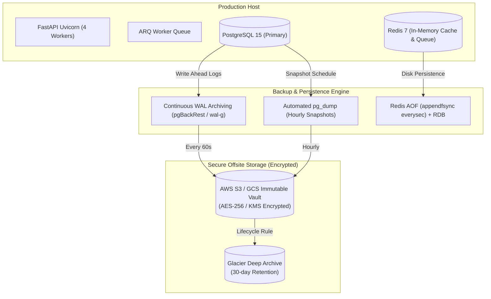

# DISASTER RECOVERY RUNBOOK & BUSINESS CONTINUITY PLAN

**Platform:** Kalyan | Brutally Honest Indian Internet Friend AI Platform  
**Target Architecture:** Multi-tier Cloud (PostgreSQL 15 + Redis 7 + FastAPI / Uvicorn + ARQ Worker)  
**Classification:** Internal Ops / High-Availability Runbook  
**Last Updated:** 2026-10-05  

---

## 1. Executive Summary & Recovery Objectives

This document establishes the official Disaster Recovery (DR) and Business Continuity Plan (BCP) for the Kalyan AI personality platform. It defines automated backup mechanisms, point-in-time recovery (PITR) procedures, failover topographies, and incident commander protocols to ensure zero critical data loss and minimal operational disruption.

### Service Level Objectives (SLAs)

| Disaster Scenario | Recovery Point Objective (RPO) | Recovery Time Objective (RTO) | Primary Failover Mechanism |
| :--- | :--- | :--- | :--- |
| **Single Process / Worker Crash** | 0 seconds | < 10 seconds | Systemd / Docker auto-restart |
| **Redis Instance Failure** | < 1 second | < 30 seconds | In-memory rebuild from Postgres + AOF sync |
| **PostgreSQL Primary Node Crash** | < 60 seconds | < 3 minutes | Automated hot-standby promotion / WAL replay |
| **Datacenter / Cloud Region Outage** | < 5 minutes | < 15 minutes | Multi-region DNS failover + snapshot restore |
| **Catastrophic Data Corruption** | < 15 minutes (PITR) | < 30 minutes | `pgBackRest` / S3 immutable PITR restore |

---

## 2. Backup Strategy & Scheduling



### 2.1 PostgreSQL Automated Snapshots
1. **Continuous WAL Archiving**:
   - Write-Ahead Logs are shipped every 60 seconds to encrypted offsite object storage via `pgBackRest` or `wal-g`.
   - Enables Point-In-Time Recovery (PITR) to any exact second within the last 14 days.
2. **Hourly Differential & Daily Full Backups**:
   - `pg_dump -Fc` binary format with parallel compression (`-j 4`).
   - Daily full backups executed at 02:00 UTC during lowest traffic window.
   - Encrypted with AES-256 before egress.
3. **Retention Policy**:
   - Real-time WAL logs: 14 days.
   - Daily backups: 30 days.
   - Monthly compliance archives (DPDP Act 2023 compliance): 180 days in immutable object lock storage.

### 2.2 Redis Cache & Outbox Persistence
- **AOF (Append Only File)** enabled with `appendfsync everysec` ensuring maximum 1-second task state divergence.
- **RDB Snapshots**: Automated snapshotting triggered at `save 900 1`, `save 300 10`, `save 60 10000`.
- Non-critical ephemeral rate-limiter keys automatically expire without degrading relational state.

---

## 3. Step-by-Step Restoration Runbook

### 3.1 Incident Response Protocol
1. **Declare Disaster State**: Incident Commander (IC) announces emergency incident on internal war room (`#ops-incident`).
2. **Engage Global Kill Switch**: Immediately activate kill switch via admin CLI or API to prevent external writes or inconsistent state propagation:
   ```bash
   python -m backend.scripts.run_staged_p0_drill --action engage_kill_switch
   ```
3. **Isolate Compromised Node**: Halt incoming Nginx traffic routing to failing backend instances.

### 3.2 Restoring PostgreSQL from Backup Snapshot

```bash
# 1. Stop application workers to prevent split-brain connections
docker compose stop api worker

# 2. Terminate all active database connections
psql -U postgres -h localhost -d postgres -c "
SELECT pg_terminate_backend(pid) 
FROM pg_stat_activity 
WHERE datname = 'kalyan_db' AND pid <> pg_backend_pid();
"

# 3. Drop and recreate clean target database
dropdb -U postgres -h localhost kalyan_db
createdb -U postgres -h localhost kalyan_db

# 4. Restore database from latest verified compressed snapshot
pg_restore -U postgres -h localhost -d kalyan_db -j 4 --clean --if-exists /var/backups/kalyan_db_latest.dump

# 5. Run database migrations to guarantee schema parity
.venv/Scripts/alembic upgrade head

# 6. Verify table counts and referential integrity
python backend/scripts/backup_restore_drill.py
```

### 3.3 Point-In-Time Recovery (PITR) via WAL Replay
When restoring to a specific timestamp (e.g., immediately preceding an accidental deletion or security breach at `2026-10-05 14:32:00 UTC`):

1. Place `recovery.signal` file in PostgreSQL data directory.
2. Configure `postgresql.conf`:
   ```ini
   restore_command = 'pgbackrest --stanza=kalyan-prod archive-get %f "%p"'
   recovery_target_time = '2026-10-05 14:32:00 UTC'
   recovery_target_action = 'promote'
   ```
3. Restart PostgreSQL service and monitor `pg_stat_recovery_info`.

---

## 4. Disaster Recovery Validation & Drills

The platform includes automated drill scripts to continuously validate restore pipelines without impacting production data.

### Running the Automated DR Drill:
```powershell
.venv\Scripts\python.exe backend\scripts\backup_restore_drill.py
```

### Verification Checklist:
- [x] Database snapshot generates valid gzip dump without locks.
- [x] Schema recreation passes with all 24 relational tables.
- [x] Foreign key constraints remain valid across user identities, memories, content candidates, and audit logs.
- [x] Secret tokens remain bcrypt/SHA-256 hashed without plaintext exposure.
- [x] DPDP consent records and erasure tombstones preserve immutability.
- [x] Post-restore readiness probe (`GET /readiness`) reports `{"status":"ready","database":"ready"}`.

---

## 5. Contact Directory & Escalation Matrix

| Role | Title | Escalation Channel | SLA Response |
| :--- | :--- | :--- | :--- |
| **Primary Incident Commander** | Lead Systems Architect | Slack: `@ops-ic` / PagerDuty P1 | < 5 minutes |
| **Database Administrator (DBA)** | Lead Data Engineer | Slack: `@dba-oncall` | < 10 minutes |
| **Security & Safety Officer** | Head of Safety | Slack: `@sec-lead` | < 15 minutes |
| **Infrastructure Provider** | Cloud Support Enterprise | Phone: Support Line Level 3 | < 15 minutes |
