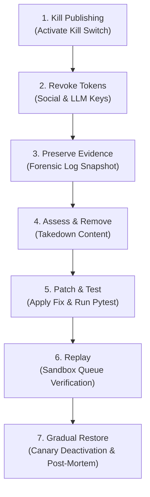

# P0 INCIDENT RESPONSE RUNBOOK & ON-CALL ROTA
**Project**: Kalyan AI Personality Venture  
**Classification**: P0 (Systemic Safety Compromise, Autonomous Rogue Post, Credential Breach, Critical Outage)  
**Target SLA**: Initial Ack < 5 min | Kill Switch < 2 min | Resolution < 2 hours

---

## 1. On-Call Rotation Schedule (2026 Q4)

| Role | Name | Handle / Pager | Primary Channel | Backup Channel | Timezone / Shift |
|---|---|---|---|---|---|
| **Primary On-Call** | S. Varma (Lead DevOps) | `@svarma_ops` | PagerDuty #p0-kalyan | Phone / SMS | 00:00 - 12:00 IST |
| **Secondary On-Call** | N. Murthy (Sr Backend) | `@nmurthy_eng` | PagerDuty #p0-kalyan | Phone / SMS | 12:00 - 24:00 IST |
| **Escalation / Incident Commander** | R. Iyer (CTO / Architect) | `@riyer_exec` | Telegram Alert Group | Direct Line | 24/7 Escalation |
| **Safety & Legal Officer** | A. Kulkarni (Trust & Safety) | `@akulkarni_legal` | Slack #ts-emergency | Phone | On-Call Consult |

**Escalation Policy**: If Primary does not acknowledge within 5 minutes, PagerDuty automatically escalates to Secondary. If no ack within 10 minutes, Incident Commander is paged directly.

---

## 2. P0 Classification Criteria
An event is classified as **P0** if ANY of the following occur:
- Rogue automated post published to social channels (X, Instagram, YouTube) violating Tier-3 safety boundaries or displaying hallucinated slander.
- Credential leak (OpenAI, Gemini, Anthropic, Razorpay, Meta API keys found in public repo or leaked in prompt output).
- Multi-tenant data breach or chat IDOR allowing unauthorized reading of private user conversations.
- Global outbox corruption or catastrophic database failure affecting all active users.

---

## 3. Mandatory 7-Step Remediation Sequence



### Step 1: Kill Publishing (Immediate Halt)
- **Action**: Immediately halt all autonomous generation and outbound social publishing.
- **CLI / API Execution**:
  ```bash
  curl -X POST https://api.kalyan.ai/api/v1/admin/kill-switch/activate \
    -H "Authorization: Bearer $ADMIN_JWT" \
    -H "Content-Type: application/json" \
    -d '{"reason": "P0 Incident: Rogue output detected. Halting all publishing."}'
  ```
- **Validation**: Check `GET /api/v1/admin/kill-switch/status` returns `{"is_active": true}`. Inbound social publishers immediately drop requests with HTTP 503.

### Step 2: Revoke Tokens
- **Action**: Invalidate and rotate all active API tokens for third-party providers (OpenAI, Gemini, Meta Graph API, Twitter OAuth).
- **Execution**:
  - In Meta App Dashboard: Regenerate Page Access Token.
  - In X Developer Portal: Invalidate Consumer Secret and Bearer Token.
  - In Cloud Provider Secrets Manager: Update `GEMINI_API_KEY`, `OPENAI_API_KEY`, `ANTHROPIC_API_KEY`.
  - Restart API container instances to flush old in-memory credentials.

### Step 3: Preserve Evidence (Forensic Snapshot)
- **Action**: Snapshot system state before any database modifications or log rotations.
- **Execution**:
  ```bash
  python backend/scripts/backup_restore_drill.py
  # Copy logs and audit events to immutable incident bucket
  tar -czf /var/log/incident_p0_$(date +%s).tar.gz /var/log/kalyan/
  ```
- Retain database records from `audit_logs`, `content_candidates`, and `chat_messages`.

### Step 4: Assess & Remove
- **Action**: Audit public channels for rogue posts and execute immediate takedown.
- **Execution**:
  - Query `content_candidates` where `status = 'published'` in the last 2 hours.
  - Call social gateway deletion APIs:
    - X API: `DELETE /2/tweets/:id`
    - Instagram Graph API: `DELETE /{media-id}`
  - If social API fails, manual operator deletion via official platform web console.

### Step 5: Patch & Test
- **Action**: Identify root cause (e.g. prompt injection bypass, safety classifier threshold, policy engine gap).
- **Execution**:
  - Reproduce failure in isolated regression test under `backend/tests/`.
  - Apply fix to code / system prompt / safety engine.
  - Run full test suite:
    ```bash
    pytest backend/tests/ -v
    ```
  - Verify 100% pass before deployment.

### Step 6: Replay
- **Action**: Replay stalled or intercepted outbox queue items in sandbox environment to confirm that clean traffic passes and hazardous payloads are blocked.
- **Execution**:
  - Run sandboxed test harness verifying that patched filters intercept the exact payload that caused the incident.

### Step 7: Gradual Restore
- **Action**: Controlled deactivation of kill switch and staged traffic reintroduction.
- **Execution**:
  ```bash
  curl -X POST https://api.kalyan.ai/api/v1/admin/kill-switch/deactivate \
    -H "Authorization: Bearer $ADMIN_JWT" \
    -H "Content-Type: application/json" \
    -d '{"reason": "P0 Incident Resolved: Patches verified, canary monitoring active."}'
  ```
- **Post-Mortem**: Publish blameless post-mortem report to `docs/INCIDENTS/` within 24 hours detailing root cause, timeline, customer impact, and preventive actions.
